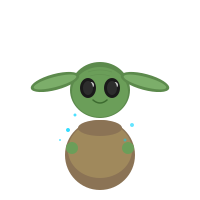

<!-- 
  ⚠️ INSTRUÇÕES:
  
  1. Crie o repo "PedroSousaAlmeida" no GitHub
  2. Faça upload dos 3 arquivos SVG para a RAIZ do repo:
     - header-banner.svg
     - lightsaber-divider.svg  
     - grogu.svg
  3. Cole este README.md no repo
  4. Para a snake animation, siga as instruções no final do arquivo
-->

<!-- ═══════════════════════════════════════════════════ -->
<!-- HEADER BANNER ANIMADO COM SABRES DE LUZ -->
<!-- ═══════════════════════════════════════════════════ -->

 

<!-- TYPING SVG ANIMADO -->

 

<!-- BADGES -->

 

<!-- ═══════════════════════════════════════════════════ -->
<!-- GROGU + ABOUT ME -->
<!-- ═══════════════════════════════════════════════════ -->

### Este é o caminho. 🌌

 

  

<!-- SABRE DIVIDER -->

 

<!-- ═══════════════════════════════════════════════════ -->
<!-- TECH STACK -->
<!-- ═══════════════════════════════════════════════════ -->

## 🛸 Arsenal do Jedi

 

  

<table>
<tr>
<td align="center" width="150">
 
🔵 Sabre Principal
</td>
<td align="center" width="150">
 
⚡ Força Relâmpago
</td>
<td align="center" width="150">
 
🛡️ Escudo Jedi
</td>
<td align="center" width="150">
 
🚀 Hyperdrive
</td>
</tr>
</table>

 

### 🔧 Ferramentas & Tecnologias

  

<!-- SABRE DIVIDER -->

 

<!-- ═══════════════════════════════════════════════════ -->
<!-- GITHUB STATS -->
<!-- ═══════════════════════════════════════════════════ -->

## 📊 Holocron de Estatísticas

 

<!-- STATS via github-profile-summary-cards (mais estável) -->

 

 

  

<!-- STREAK (demolab é mais estável) -->

  

<!-- ACTIVITY GRAPH -->

  

<!--
  ╔═══════════════════════════════════════════════════════════════╗
  ║  💡 STATS NÃO APARECENDO?                                    ║
  ║                                                               ║
  ║  Se algum card não carregar, pode ser rate limit do Vercel.   ║
  ║  A solução mais confiável é fazer seu próprio deploy:         ║
  ║                                                               ║
  ║  1. Vá em: https://github.com/vn7n24fzkq/github-profile-     ║
  ║     summary-cards                                             ║
  ║  2. Clique "Deploy with Vercel"                               ║
  ║  3. Use seu domínio no lugar de                               ║
  ║     github-profile-summary-cards.vercel.app                   ║
  ║                                                               ║
  ║  Mesma coisa pro streak-stats e activity-graph.               ║
  ╚═══════════════════════════════════════════════════════════════╝
-->

<!-- SABRE DIVIDER -->

 

<!-- ═══════════════════════════════════════════════════ -->
<!-- POWER LEVEL -->
<!-- ═══════════════════════════════════════════════════ -->

## ⚡ Poder de Combate

 

  

<table>
<tr>
<td align="center">

 
<b>Companheiro de Jornada</b>
</td>
<td align="center">

| ⚔️ Atributo | 📊 Nível |
|:---|:---|
| **Rank** | Cavaleiro Jedi |
| **Especialidade** | Full Stack |
| **Sabre** | Azul (Guardião) 🔵 |
| **Mestre** | Open Source |
| **Missões** | Em andamento... |

</td>
<td align="center">

| 🏅 Conquista | Status |
|:---|:---:|
| Primeiro commit | ✅ |
| 100+ commits | ✅ |
| PR aceito | ✅ |
| Issue resolvida | ✅ |
| 1000 commits | 🔄 |
| Mestre Open Source | 🔜 |

</td>
</tr>
</table>

 

<!-- SABRE DIVIDER -->

 

<!-- ═══════════════════════════════════════════════════ -->
<!-- SNAKE -->
<!-- ═══════════════════════════════════════════════════ -->

## 🐍 Contribuições devorando a Galáxia

<picture>
  <source media="(prefers-color-scheme: dark)" srcset="https://raw.githubusercontent.com/PedroSousaAlmeida/PedroSousaAlmeida/output/github-snake-dark.svg" />
  <source media="(prefers-color-scheme: light)" srcset="https://raw.githubusercontent.com/PedroSousaAlmeida/PedroSousaAlmeida/output/github-snake.svg" />
  
</picture>

<!--
  🔧 COMO ATIVAR A SNAKE:
  1. No repo PedroSousaAlmeida → Settings → Actions → General
  2. Em "Workflow permissions" → "Read and write permissions" → Save
  3. Crie o arquivo .github/workflows/snake.yml com:

  name: Generate Snake
  on:
    schedule:
      - cron: "0 */12 * * *"
    workflow_dispatch:
  jobs:
    build:
      runs-on: ubuntu-latest
      steps:
        - uses: Platane/snk@v3
          with:
            github_user_name: PedroSousaAlmeida
            outputs: |
              dist/github-snake.svg
              dist/github-snake-dark.svg?palette=github-dark
        - uses: crazy-max/ghaction-github-pages@v3.1.0
          with:
            target_branch: output
            build_dir: dist
          env:
            GITHUB_TOKEN: ${{ secrets.GITHUB_TOKEN }}

  4. Vá em Actions → "Generate Snake" → "Run workflow"
-->

 

<!-- SABRE DIVIDER -->

 

<!-- ═══════════════════════════════════════════════════ -->
<!-- JEDI QUOTE -->
<!-- ═══════════════════════════════════════════════════ -->

## 💬 Transmissão Jedi

 

> *"Em meu código, não há emoção, há lógica.*
> *Não há ignorância, há documentação.*
> *Não há caos, há versionamento.*
> *Não há bugs, há... ok, tem bugs."*
>
> — **O Código Jedi** (adaptado)

 

<!-- RANDOM DEV QUOTE -->

  

<!-- SABRE DIVIDER -->

 

<!-- ═══════════════════════════════════════════════════ -->
<!-- CONNECT -->
<!-- ═══════════════════════════════════════════════════ -->

## 📡 Holopad de Comunicação

 

<!-- ⚠️ TROQUE PELOS SEUS LINKS REAIS -->

  

<!-- FINAL MESSAGE -->

  

<!-- FOOTER -->

